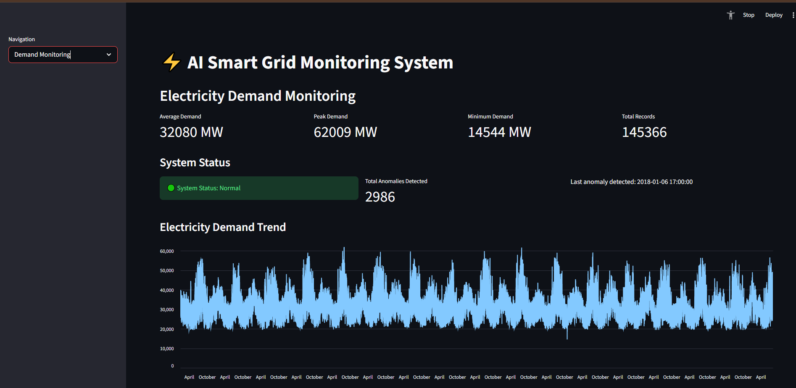

# ⚡ AI-Powered Smart Grid Monitoring System

An AI-based monitoring system that forecasts electricity demand and detects abnormal energy consumption patterns using machine learning and deep learning models.

---

## 📌 Project Overview

Modern power grids require accurate demand forecasting and rapid anomaly detection to maintain stability.
This project builds an **AI-powered smart grid monitoring platform** that:

• Forecasts electricity demand
• Detects abnormal consumption patterns
• Visualizes results through an interactive dashboard

The system uses **time-series models and deep learning techniques** to analyze electricity usage patterns.

---

## 🧠 Models Used

### 1️⃣ SARIMA (Statistical Model)

Used as a baseline forecasting model for electricity demand.

### 2️⃣ LSTM Neural Network

A deep learning model designed for sequential data that captures complex temporal patterns in energy demand.

### 3️⃣ LSTM Autoencoder

Used for anomaly detection by learning normal electricity consumption patterns and detecting deviations.

---

## 📊 Results

| Model  | RMSE | MAE  |
| ------ | ---- | ---- |
| SARIMA | 5388 | 4092 |
| LSTM   | 2194 | 1682 |

The LSTM model significantly improves forecasting accuracy compared to the statistical baseline.

---

## ⚡ Key Features

✔ Electricity demand monitoring
✔ AI-based demand forecasting
✔ Anomaly detection system
✔ Interactive Streamlit dashboard
✔ Smart grid alert system

---

## 🖥 Dashboard

The system includes an interactive dashboard built with Streamlit that allows users to:

• Monitor electricity demand trends
• View AI demand forecasts
• Detect abnormal consumption patterns
• Analyze model performance

---


## 🗂 Project Structure

```
ai-smart-grid-monitoring
│
├── dashboard.py
├── smart-grid-ai.ipynb
├── requirements.txt
├── README.md
├── data/
└── models/   (ignored due to large size)
```

---

## ⚙️ Installation

Clone the repository:

```
git clone https://github.com/Artemiz0307/ai-smart-grid-monitoring.git
```

Install dependencies:

```
pip install -r requirements.txt
```

Run the dashboard:

```
streamlit run dashboard.py
```

---

## 📚 Dataset

PJM Hourly Energy Consumption Dataset.

---

## 🚀 Future Improvements

• Real-time smart grid monitoring
• Weather-based demand forecasting
• Deployment of the dashboard online
• Advanced anomaly detection methods

---

## 👤 Author

Artemiz0307
